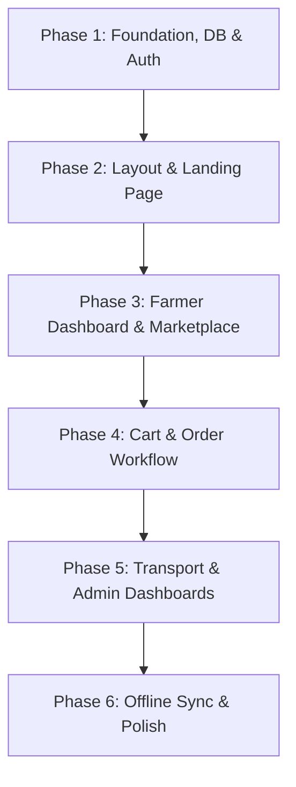

# FarmLink Ghana MVP - Development Plan

This document outlines the structured, phase-by-phase development roadmap for building **FarmLink Ghana** within a 24-48 hour hackathon timeline.

---

## Technical Overview & Design Decisions

### Open Decisions
*   **Geospatial / Coordinate System:** For calculating distances in the Smart Recommendation algorithm, we will map a predefined list of major towns in the Ashanti Region (Kumasi, Obuasi, Mampong, Konongo, Ejura, Bekwai, Offinso) to static latitude/longitude coordinates. This avoids dynamic geocoding API errors and minimizes latency.
*   **Authentication Flow:** Standard Email & Password auth will be used (configured via Supabase Auth) with user metadata roles (`farmer`, `buyer`, `transporter`, `admin`) to simplify implementation.

---

## Roadmap Phases

---

### Phase 1: Foundation, DB, & Auth
*   **Objective:** Scaffolding the workspace, configuring Supabase, establishing schemas and policies, and building registration/login flows.
*   **Features:** Role-based signup and session routing, database configuration, tables with Row-Level Security (RLS).
*   **Dependencies:** `@supabase/supabase-js`, `@supabase/ssr`, `zod`, `react-hook-form`, `@hookform/resolvers`, `lucide-react`.
*   **Files to Create:**
    *   [package.json](file:///c:/Users/HP/Documents/WORK/DigiFarmLink/package.json) - Node dependencies & Tailwind CSS structure.
    *   [schema.sql](file:///c:/Users/HP/Documents/WORK/DigiFarmLink/supabase/migrations/20260707000000_init.sql) - Supabase tables setup.
    *   [seed.sql](file:///c:/Users/HP/Documents/WORK/DigiFarmLink/supabase/seed.sql) - Database seed data for Ghanaian farmers, listings, and buyers.
    *   [supabaseClient.ts](file:///c:/Users/HP/Documents/WORK/DigiFarmLink/utils/supabaseClient.ts) - Supabase context provider.
    *   [middleware.ts](file:///c:/Users/HP/Documents/WORK/DigiFarmLink/middleware.ts) - Page guard middleware.
    *   [login/page.tsx](file:///c:/Users/HP/Documents/WORK/DigiFarmLink/app/login/page.tsx) / [register/page.tsx](file:///c:/Users/HP/Documents/WORK/DigiFarmLink/app/register/page.tsx) - Auth pages.
*   **Database Changes Required:** 
    *   Create tables: `users`, `farmer_profiles`, `buyer_profiles`, `transport_profiles`, `produce`, `orders`, `transport_requests`, `reviews`, `notifications`, `admin_logs`.
    *   Enable RLS policies for each role.
*   **Testing Approach:** Run schema migrations and seed scripts to verify database sanity. Test user signup and login to verify correct role-based routing.

---

### Phase 2: Common Layout & Landing Page
*   **Objective:** Implement style tokens, shared navigation headers, and a high-converting Landing Page.
*   **Features:** Sticky Navbar, footer, animated hero, statistics dashboard teaser, interactive how-it-works, FAQs, CTA.
*   **Dependencies:** `framer-motion`, `class-variance-authority`, `clsx`, `tailwind-merge`.
*   **Files to Create:**
    *   [globals.css](file:///c:/Users/HP/Documents/WORK/DigiFarmLink/app/globals.css) - Tailwind custom configuration and agricultural CSS styling.
    *   [Navbar.tsx](file:///c:/Users/HP/Documents/WORK/DigiFarmLink/components/layout/Navbar.tsx) / [Footer.tsx](file:///c:/Users/HP/Documents/WORK/DigiFarmLink/components/layout/Footer.tsx) - Common layout elements.
    *   [page.tsx](file:///c:/Users/HP/Documents/WORK/DigiFarmLink/app/page.tsx) - Main landing page.
    *   [ui/](file:///c:/Users/HP/Documents/WORK/DigiFarmLink/components/ui/) - Core shadcn/ui buttons, cards, forms.
*   **Database Changes Required:** None.
*   **Testing Approach:** Visual verification on mobile, tablet, and desktop viewports. Ensure header links reflect session auth state.

---

### Phase 3: Farmer Dashboard & Marketplace
*   **Objective:** Enable listing features for farmers and browsing functionality for buyers.
*   **Features:** Product upload portal, image handling, search filters, non-AI Smart Recommendation engine.
*   **Dependencies:** None.
*   **Files to Create:**
    *   [farmer/page.tsx](file:///c:/Users/HP/Documents/WORK/DigiFarmLink/app/dashboard/farmer/page.tsx) - Farmer control panel.
    *   [produce/new/page.tsx](file:///c:/Users/HP/Documents/WORK/DigiFarmLink/app/dashboard/farmer/produce/new/page.tsx) - Produce upload form.
    *   [marketplace/page.tsx](file:///c:/Users/HP/Documents/WORK/DigiFarmLink/app/marketplace/page.tsx) - Produce feed.
    *   [marketplace/[id]/page.tsx](file:///c:/Users/HP/Documents/WORK/DigiFarmLink/app/marketplace/[id]/page.tsx) - Details view.
    *   [recommendation.ts](file:///c:/Users/HP/Documents/WORK/DigiFarmLink/utils/recommendation.ts) - Location-based weighted recommendation algorithm.
*   **Database Changes Required:** Insert logic for `produce` table, connection to Supabase storage bucket `produce-images`.
*   **Testing Approach:** Test adding a listing as a farmer (with mock images). Verify marketplace renders with recommendations sorted by score (closest + freshest first).

---

### Phase 4: Cart & Order Workflow
*   **Objective:** Support buyer cart updates, checkout logic, and the order state machine.
*   **Features:** Persistent local cart state, checkouts, farmer order management screens.
*   **Dependencies:** None.
*   **Files to Create:**
    *   [useCart.ts](file:///c:/Users/HP/Documents/WORK/DigiFarmLink/hooks/useCart.ts) - Caching cart logic in localStorage.
    *   [cart/page.tsx](file:///c:/Users/HP/Documents/WORK/DigiFarmLink/app/cart/page.tsx) / [checkout/page.tsx](file:///c:/Users/HP/Documents/WORK/DigiFarmLink/app/checkout/page.tsx) - Checkout pages.
    *   [orders.ts](file:///c:/Users/HP/Documents/WORK/DigiFarmLink/app/actions/orders.ts) - Server actions for placing orders and state updates.
*   **Database Changes Required:** 
    *   Insert capability to `orders`.
    *   Trigger to auto-create a delivery request in `transport_requests` when a farmer transitions an order to `Accepted`.
*   **Testing Approach:** Complete cart actions, execute checkouts, and verify matching order database entries are created. Transition order as farmer to verify transport requests are spawned.

---

### Phase 5: Transport & Admin Dashboards
*   **Objective:** Set up delivery routing interfaces and global administrative controls.
*   **Features:** Available deliveries index with Leaflet maps, delivery status updating, transporter earnings log, admin dashboards for analytics and moderation.
*   **Dependencies:** `leaflet`, `react-leaflet`, `recharts`.
*   **Files to Create:**
    *   [transporter/page.tsx](file:///c:/Users/HP/Documents/WORK/DigiFarmLink/app/dashboard/transporter/page.tsx) - Delivery list & accept portal.
    *   [TransportMap.tsx](file:///c:/Users/HP/Documents/WORK/DigiFarmLink/components/maps/TransportMap.tsx) - Dynamic Leaflet rendering of pickup and delivery coordinates.
    *   [admin/page.tsx](file:///c:/Users/HP/Documents/WORK/DigiFarmLink/app/dashboard/admin/page.tsx) - Analytics and system overview.
    *   [admin/users/page.tsx](file:///c:/Users/HP/Documents/WORK/DigiFarmLink/app/dashboard/admin/users/page.tsx) - User moderation panel.
*   **Database Changes Required:** Update queries to transition `transport_requests` status (`accepted`, `picked_up`, `delivered`).
*   **Testing Approach:** Accept a logistics job, review coordinates on Leaflet, change status levels. Confirm order completion as a buyer and verify transporter earnings update.

---

### Phase 6: Offline Sync & Polish
*   **Objective:** Implement network resilience helpers and finalize look-and-feel transitions.
*   **Features:** Local storage offline queueing, background synchronizer, loading skeleton displays.
*   **Dependencies:** None.
*   **Files to Create:**
    *   [useOfflineSync.ts](file:///c:/Users/HP/Documents/WORK/DigiFarmLink/hooks/useOfflineSync.ts) - Offline queue helper.
    *   [toaster.tsx](file:///c:/Users/HP/Documents/WORK/DigiFarmLink/components/ui/toaster.tsx) - Alert banners.
*   **Database Changes Required:** None.
*   **Testing Approach:** Simulated offline page actions inside DevTools. Queue a produce listing, reconnect the internet, and verify the queued item is automatically written to Supabase.
